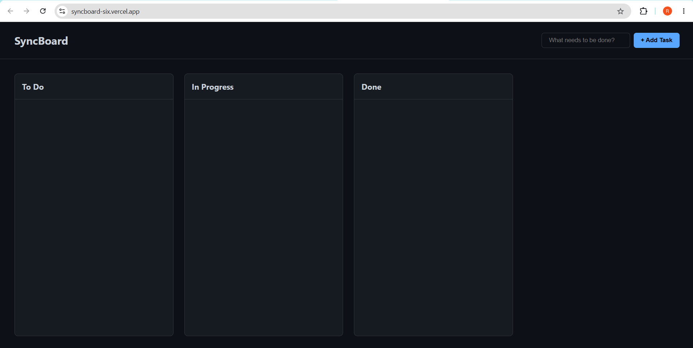

# SyncBoard - Workflow Manager

## 🚀 Live Demo
**[View SyncBoard Live on Vercel]([https://syncboard-demo.vercel.app/](https://syncboard-six.vercel.app/))**

## 📸 Project Preview
 

## 📌 Project Overview
SyncBoard is a lightweight, frontend-only Kanban board designed to manage project workflows. Built entirely with vanilla JavaScript, it allows users to create tasks, seamlessly drag and drop them between progress columns, and permanently save their state using browser local storage.

## ✨ Features
- **Native Drag and Drop:** Utilizes the HTML5 Drag and Drop API for smooth, tactile task management across columns.
- **Data Persistence:** Integrates with the browser's `localStorage` API, ensuring that all tasks and column states survive page reloads and browser closures.
- **Dynamic DOM Manipulation:** Efficiently creates, reads, updates, and deletes (CRUD) DOM elements based on the underlying data state.
- **Responsive Layout:** Employs CSS Flexbox to create a scalable, horizontally scrolling board ideal for varying monitor sizes.

## 🛠️ Technical Decisions & Impact
- **Vanilla Implementation:** Consciously avoided libraries like React Beautiful DnD or SortableJS to demonstrate a fundamental understanding of native browser APIs and event delegation.
- **State Management:** Designed a single source of truth (a JSON array) to manage application state. The DOM acts strictly as a visual representation of this data, cleanly separating logic from presentation.
- **Event Optimization:** Bound drag events only to individual elements while binding drop zones to parent containers, optimizing memory usage and avoiding event listener bloat.

## 🚀 Getting Started
1. Clone the repository: `git clone [https://github.com/yourusername/syncboard.git](https://github.com/Sanjayreddi/syncboard)`
2. Open `index.html` in your preferred web browser. 
3. No build tools or backend servers are required.

## 🔮 Future Enhancements
- Implement sub-tasks and task editing (double-click to edit).
- Add functionality to drag and reorder tasks *within* the same column.
- Introduce a "Dark/Light Mode" toggle utilizing CSS variables.
